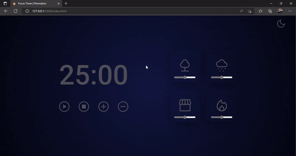

# 
 Focus Timer | Pomodoro 

This is a pomodoro style counter, with the option to select the minutes from 5 to 5, pause, stop and turn on and off forest, rain, coffee shop and fireplace sounds.

## 
 💁🏻‍♂️ Demonstration 

## 📚 Learnings

Using the DOM in the browser, callback functions, knowing what recursion is, Clean Code principles, scopes, ES6 Modules, factory pattern, dependency injection, code refactoring, adding sounds and audio volume change through JavaScript and change of themes.

## ♻️ Functionalities

- Dark and light themes
- Stopwatch
- Sound-on, sound-off
- Audio volume change
- Responsive

## 🛠 Tech stacks used

> Front-end: 

- HTML
- CSS
- JavaScript

## 📈 Improvements

Refactorings, performance and accessibility.

## 🙂 Feedback

If you have any feedback, please send it to me at ricardodev10@yahoo.com

## 💛 Author

- [Ricardo Junior](https://www.linkedin.com/in/ricardodev10/)