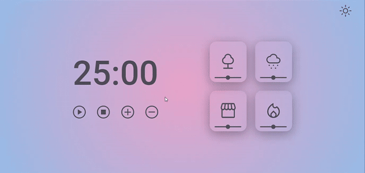

<h1 align="center"> Focus Timer | Pomodoro </h1>

This is a pomodoro style counter in dark mode, with the option to select the minutes from 5 to 5, pause, stop, turn on/off forest sounds, rain, coffee shop, fireplace, and volume change.

  <a href="#-technologies">Technologies</a>&nbsp;&nbsp;&nbsp;|&nbsp;&nbsp;&nbsp;
  <a href="#-learnings">Learnings</a>&nbsp;&nbsp;&nbsp;|&nbsp;&nbsp;&nbsp;
  <a href="#-functionalities">Functionalities</a>&nbsp;&nbsp;&nbsp;|&nbsp;&nbsp;&nbsp;
  <a href="#-improvements">Improvements</a>&nbsp;&nbsp;&nbsp;|&nbsp;&nbsp;&nbsp;
  <a href="#-layout">Layout</a>&nbsp;&nbsp;&nbsp;|&nbsp;&nbsp;&nbsp;
  <a href="#-deploy">Deploy</a>&nbsp;&nbsp;&nbsp;|&nbsp;&nbsp;&nbsp;
  <a href="#-feedback">Feedback</a>&nbsp;&nbsp;&nbsp;|&nbsp;&nbsp;&nbsp;
  <a href="#-author">Author</a>

## 💁🏻‍♂️ Demonstration

## 🛠 Technologies

> Front-end: 

- HTML
- CSS
- JavaScript

## 📚 Learnings

Using the DOM in the browser, callback functions, knowing what recursion is, Clean Code principles, scopes, ES6 Modules, factory pattern, dependency injection, code refactoring, adding sounds and audio volume change through JavaScript and change of themes.

## ♻️ Functionalities

- Dark and light themes
- Stopwatch
- Sound-on, sound-off
- Audio volume change
- Responsive

## 📈 Improvements

Refactorings, performance and accessibility.

## 🎨 Layout

You can view the layout of the project through [THIS LINK](https://www.figma.com/file/G1w8SwPFoDXNma1wwU6hL2/Stage-05---Dark-Mode-FocusTimer-(Copy)?node-id=0%3A1). You need an account on [Figma](https://figma.com) to access it.

## 🚀 Deploy

https://focus-timer-ricardodev10.vercel.app/

## 🙂 Feedback

If you have any feedback, please send it to me at ricardodev10@yahoo.com

## 💛 Author

### Made with ♥ by [Ricardo Junior](https://www.linkedin.com/in/ricardodev10/) :wave:

Learning is continuous and there will always be a next level.

&nbsp;&nbsp;&nbsp;&nbsp;

 